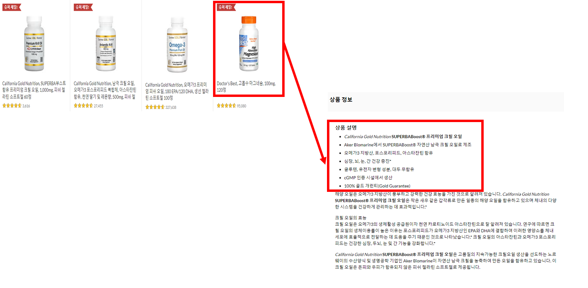
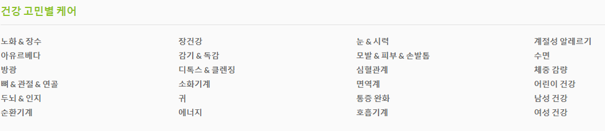
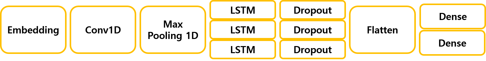
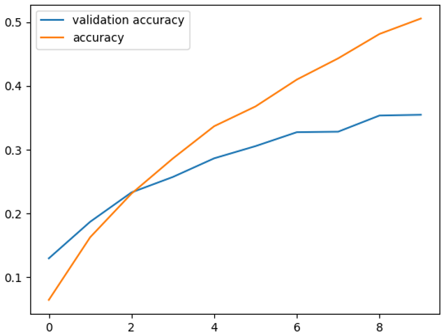
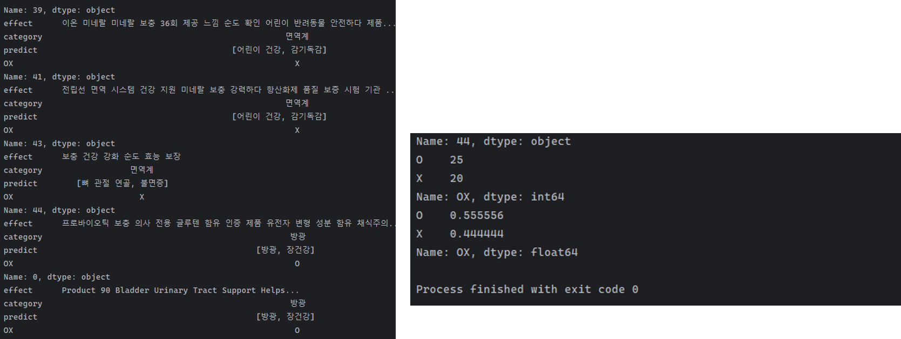

# IntelCapsule

## 1. 프로젝트 목표

영양제 성분 정보를 바탕으로 영양제가 어떤 효능을 보여주는지 알려준다.

## 2. 개발 기간 및 참여 인원

* 개발 기간: 2023.10.17. ~ 2023.10.20.
* 참여 인원: 4인
* 역할 분담
  * 윤희승 - 데이터 크롤링, 데이터 전처리 [preprocessing](./03_preprocesing.py)
  * 김경민 - 데이터 크롤링, 데이터 정합 [data concate](./02_data_concat.py), [data rename](rename_columns.py)
  * 김도영 - 데이터 크롤링, 모델 예측 [model predict](./05_model_predict.py)
  * 조지현 - 데이터 크롤링, 모델 설계, 학습 [model learning](./04_model_learning.py) 

## 3. 기술 스택 및 개발 환경

* 개발 언어: Python
* 개발 환경: Window 11, PyCharm IDE, Anaconda venv(Python 3.7)
* 기술 스택: Tensorflow, Keras

[requirements.txt](./requirements.txt)

## 4. [핵심 기능 및 개선사항](IntelCapsule-최종.pdf)(pdf 파일)

### 1. 데이터 크롤링

- Selenium 모듈의 Chrome Driver를 사용하여 [iHerb](https://kr.iherb.com/) 사이트에 접속
- XPath, CLASS_NAME 등을 이용해서 DOM 구조의 요소에 접근하여 영양제 성분 정보 수집



```python
product = driver.find_elements(By.CLASS_NAME, 'product-cell-container') # 각 상품 컨테이너 리스트
.
.
driver.find_element('xpath', xpath_temp).click() # 상품 컨테이너 클릭
.
.
nutrient_data = driver.find_elements(By.XPATH, '//div[@itemprop="description"]/ul') # 상품 상세 정보 
```

### 2. 데이터 전처리
- 수집한 데이터에서 중복, 유사한 문장 제거
```python
from difflib import SequenceMatcher

for i in range(len(X)-1):
    if X[i] is not None:
        fst = X[i]
        for j in range(i+1,len(X)):
            if i != j and X[j] is not None:
                scd = X[j]
                # 두 문장을 비교하여 유사성을 구함
                ratio = SequenceMatcher(None, fst, scd).ratio()                 
                # 일치율이 90% 이상일 경우 두번째 문장을 지움
                if ratio >= 0.9:                                                
                    print('remove similar data,{} :{}'.format(j, scd))

```
- 특수 문자, 불용어, 한 글자, 너무 짧은 문장 제거
```python
# 한글, 영어, 숫자 이외의 숫자 제거
data = re.compile('[^가-힣|a-z|A-Z|0-9]').sub(' ', data.text) 
.
.
.
# 각 문장마다 형태소 개수 만큼 반복
for j in range(len(X[i])):                                  
  # 한글자 제거  
  if len(X[i][j]) > 1:                                    
        # 불용어 제거
        if X[i][j] not in list(stopwords['stopword']):      
            words.append(X[i][j])
# 단어가 10개 미만일 경우 제거
if len(words) >=10:                                         
    X[i] = ' '.join(words)
```
- 각 문장마다 형태소로 분리, 각 형태소에 라벨 부여
```python
# 한국어 형태소 분석 모듈
from konlpy.tag import Okt
okt = Okt()

for i in range(len(X)):
    try:
        # 각 문장마다 형태소로 분리
        X[i] = okt.morphs(X[i], stem=True)
    except:
        print('error okt: ', i, len(X))
.
.
.
token = Tokenizer()
# 각 형태소에 라벨 부여
token.fit_on_texts(X)                               
tokened_x = token.texts_to_sequences(X)             
wordsize = len(token.word_index) + 1
```

### 3. 모델 설계, 학습

- 총 24가지 효능으로 분류



- 모델 구조
  - 차원 축소 레이어(Embedding), 컨볼루션 레이어, LSTM 레이어로 구성
  - 학습 중 과적합(Overfitting)을 방지하기 위해 Dropout Layer 추가



- 학습 결과 
  - 학습 중 과적합(Overfitting)을 방지하기 위해 EarlyStopping 콜백 함수 사용
  - 10 epoch에서 학습 종료 (초기 설정: 20 epoch)
    


### 4. 모델 예측

- 모델 테스트에 사용할 데이터 수집([predict crawling](./job6_predict_crawling_data.py))
- 예측 결과


---

Contact: <ddakae23@gmail.com> 
